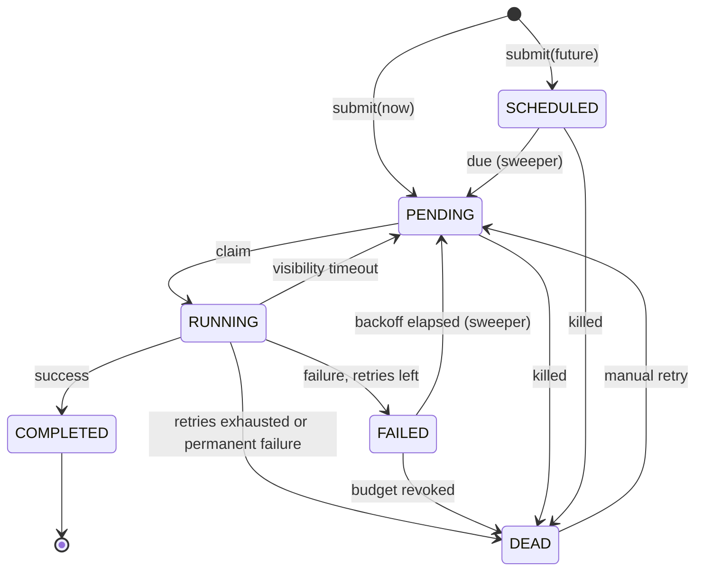

# The job lifecycle

Six states, with every legal transition declared explicitly in `JobState`
(`dispatch-core/src/main/java/dev/dispatch/core/job/JobState.java`) and validated on every
change. The database enforces the same set with a `CHECK` constraint, so a stray hand-written
`UPDATE` cannot invent a seventh state.

| State | Meaning |
| --- | --- |
| `PENDING` | Claimable right now (subject to `scheduled_at <= now`). |
| `SCHEDULED` | Submitted with a future `scheduledAt`; not yet attempted. |
| `RUNNING` | Claimed by a worker; holds a visibility lease that expires at `lockedUntil`. |
| `COMPLETED` | Finished successfully. Terminal. |
| `FAILED` | An attempt failed; a retry is pending once the backoff at `scheduledAt` elapses. |
| `DEAD` | Retries exhausted or permanently failed. The dead-letter state; only a manual retry revives it. |

## Three distinctions worth internalising

These are what the six states are *for*:

- **`SCHEDULED` vs `FAILED`.** Both hold a future `scheduled_at` and both are invisible to
  claiming until it passes. `SCHEDULED` means "delayed, never attempted"; `FAILED` means
  "attempted, waiting out a backoff". Collapsing them would make `GET /stats` unable to
  distinguish a healthy backlog from a retry storm.
- **`FAILED` vs `DEAD`.** `FAILED` is transient — a sweeper will promote it. `DEAD` is the
  dead-letter state, and only an operator (`POST /jobs/{id}/retry`) gets a job out of it.
- **There is no `CANCELLED`.** Cancelling a job that never ran deletes the row. A state whose
  only meaning is "this never happened" is a row you keep forever for no reason.

`COMPLETED` is a one-way door. Re-running finished work is a new job, not a resurrection.

## Who moves jobs, and when

- **Submission** creates `PENDING` (due now) or `SCHEDULED` (future `scheduledAt`).
- **The dispatcher** moves `PENDING → RUNNING` by claiming, stamping `locked_by` and
  `locked_until`.
- **The handler outcome** moves `RUNNING` to `COMPLETED`, `FAILED` (retries left, backoff
  scheduled), or `DEAD` (budget exhausted, or `PermanentJobFailureException`).
- **The maintenance sweeper** — on any instance — promotes due `SCHEDULED` and `FAILED` rows to
  `PENDING`, and returns `RUNNING` rows with expired leases to `PENDING`
  ([crash recovery](reliability.md#visibility-timeout)).
- **Operators** revive `DEAD → PENDING` with a fresh budget via the API.

Every one of these paths calls `JobState.requireTransitionTo`, so an illegal move throws rather
than corrupting the record.
