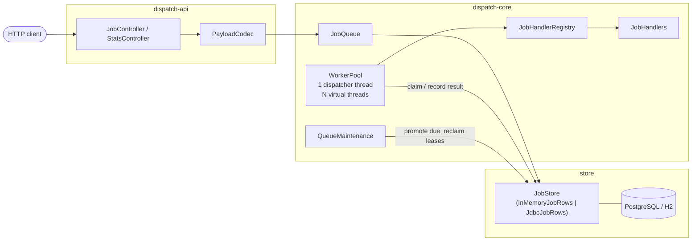

# Architecture overview

dispatch is three Gradle modules with a strict dependency direction, a small set of long-lived
components inside the engine, and a deliberate split in how threads are used.

## Modules

| Module | Depends on | What lives there |
| --- | --- | --- |
| `dispatch-core` | JDK + SLF4J | The engine. Domain model, state machine, handler registry, retry policy, `JobStore` and the `JobRows` seam beneath it, in-memory rows, virtual-thread worker pool, maintenance sweeper. No Spring, no JDBC. |
| `dispatch-postgres` | `dispatch-core` | `JdbcJobRows` — the same engine backed by PostgreSQL or H2, using `SELECT ... FOR UPDATE SKIP LOCKED`. Still no Spring. |
| `dispatch-api` | both | Spring Boot: REST controllers, configuration properties, profile wiring. |

The dependency arrow only ever points inward. `dispatch-core` cannot see Spring or JDBC — that is
enforced by the build rather than by good intentions, and it is why the engine runs fine in a
plain `main` method (`JobQueue`'s class Javadoc shows the four-line version).

## Components and data flow

- **`JobQueue`** is the engine's front door: a store, a handler registry, a worker pool and a
  maintenance sweeper, wired together. Submitting inserts a row and wakes the dispatcher, so
  locally produced work skips the poll interval.
- **`WorkerPool`** loops in a single dispatcher thread: reserve capacity, claim up to a batch of
  jobs, hand each to its own virtual thread. Results are written back conditionally on still
  holding the lease. That one cycle is also a public operation — `dispatchOnce()` — so a caller can
  drive the pool a batch at a time and be told what it claimed, instead of starting a thread and
  watching the store. Use one or the other: two claimers on one pool is refused.
- **`QueueMaintenance`** sweeps on a timer with two idempotent jobs: promote `SCHEDULED`/`FAILED`
  rows whose time has come, and return `RUNNING` rows with expired leases to `PENDING`. Every
  instance runs it against the shared store; overlapping sweeps find less to do.
- **`JobStore`** owns every rule about jobs in storage: which rows are claimable and in what order
  (`JobSelection`), when a cancel or a manual retry is refused, and the check that a worker still
  holds its lease. It is one class, not an interface — those rules have one home so two adapters
  cannot drift apart on them, which is precisely what had happened before.
- **`JobRows`** is the persistence seam underneath, and it decides nothing: hold these rows
  exclusively, write these rows back. `InMemoryJobRows` uses a lock over a map, `JdbcJobRows` uses
  a transaction and `FOR UPDATE`. Both are held to the same contract test suite
  (`JobStoreContract`) through `JobStore`, so "swappable" is a test result rather than a claim.
- **`PayloadCodec`** converts between the JSON the API speaks and the opaque string the engine
  stores. The engine never looks inside payloads — that keeps `dispatch-core` free of a JSON
  dependency and lets handlers pick their own format.

## The threading model

Handlers run one per **virtual thread**: they are numerous, short-lived and mostly blocked on
I/O, so ten thousand concurrent jobs cost ten thousand cheap stacks instead of ten thousand OS
threads. Blocking calls inside a handler are fine and expected.

The dispatcher is a **platform thread**. There is exactly one, it lives for the whole process,
and it spends its life blocked in a database call — none of the reasons to prefer a virtual
thread apply. Using one everywhere merely because they exist is how you end up not knowing what
they're for.

A claim-capacity gate sized to `concurrency` — one permit per job in flight, reserved before
each claim and conserved across every dispatch path — gates claiming, so the engine never claims
work it has no room to run. This matters more than it looks: a claimed job is invisible to every other instance
until its lease expires, so a greedy instance parks work it can't start while its idle peers
starve.

## The Spring edge

`dispatch-api` wires rather than implements: `QueueConfiguration` picks a store
(`dispatch.store`), collects every `JobHandlerRegistration` bean into the registry, translates
`QueueProperties` into the engine's `QueueConfig` (unset knobs keep the engine's own defaults, so
the numbers live in one place), and exposes `JobQueue` as a bean whose `destroyMethod = "close"`
is what makes [graceful shutdown](reliability.md#graceful-shutdown) work under Spring.

## Related

- [Job lifecycle](job-lifecycle.md) — the state machine the whole system revolves around.
- [Reliability mechanics](reliability.md) — claiming, leases, delivery guarantees, shutdown.
- [Known limitations](limitations.md) — what is deliberately not here.
